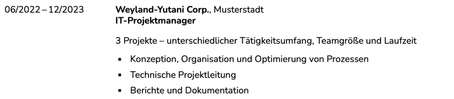
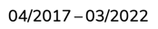

// SPDX-FileCopyrightText: © 2024 Sebastian Davids <sdavids@gmx.de>
// SPDX-License-Identifier: Apache-2.0
= sdavids-latex-german-job-application
Sebastian Davids <sdavids@gmx.de>
// Metadata:
:description: German job application in LaTeX
// Settings:
:sectnums:
:sectanchors:
:sectlinks:
:toc: macro
:toclevels: 4
:toc-placement!:
:figure-caption!:
:hide-uri-scheme:
:source-highlighter: rouge
:rouge-style: github
// Refs:
:docker-install-url: https://docs.docker.com/install/
:jetbrains-latex-install-url: https://plugins.jetbrains.com/plugin/9473-texify-idea
:mactex-install-url: https://www.tug.org/mactex/mactex-download.html
:texifier-install-url: https://www.texifier.com
:texlive-install-url: https://www.tug.org/texlive/acquire-netinstall.html
:texmaker-install-url: https://www.xm1math.net/texmaker/download.html
:texstudio-install-url: https://www.texstudio.org/#download
:vs-code-latex-install-url: https://marketplace.visualstudio.com/items?itemName=James-Yu.latex-workshop

ifdef::env-browser[:outfilesuffix: .adoc]

ifdef::env-github[]
:outfilesuffix: .adoc
:important-caption: :heavy_exclamation_mark:
:note-caption: :information_source:
endif::[]

toc::[]

This repository contains LaTeX classes, commands, and environments for a German job application.

germancv:: a link:src/germancv.cls[class] for a German curriculum vitae

== Usage

=== germancv

Apply the `germancv` class:

[,tex]
----
\documentclass{germancv}
----

Add one or more <<cvsection,cvsection>>.

==== Environments

[#cvsection]
===== cvsection

Start a new section with the given title.

[,tex]
----
\begin{cvsection}{Qualifikationen und Zusätzliches}
...
\end{cvsection}
----

⇓

Inside the `cvsection` use the following environments:

<<cvitemplain,cvitemplain>>:: will display an item without formatting
<<cvitembold,cvitembold>>:: will display the item in bold
<<cvitem,cvitem>>:: will display an item.
<<cvitemlist,cvitemlist>>:: will display an item with list content

[#cvitemplain]
===== cvitemplain

`cvitemplain` will display an item without formatting.

[,tex]
----
\begin{cvitemplain}{Sprachkenntnisse}
  Deutsch: Muttersprache, Englisch: verhandlungsicher
\end{cvitemplain}
----

⇓

[#cvitembold]
===== cvitembold

`cvitembold` will display the item in bold.

[,tex]
----
\begin{cvitembold}
    {\range{01/2024}{03/2024}}
  Persönliche Auszeit
\end{cvitembold}
----

⇓

[#cvitem]
===== cvitem

`cvitem` will display an item.

[,tex]
----
\begin{cvitem}
    {\range{11/2018}{07/2019}}
    {Studentenwerk}
    {Musterstadt}
    {Werksstudent}
    {Administration eines Studentenwohnheim-Netzwerkes mit 5 Nutzern}
\end{cvitem}
----

⇓

[,tex]
----
\begin{cvitem}
    {\range{09/2015}{08/2016}}
    {Altenheim Seniorenparadies}
    {Musterstadt}
    {Freiwilliges Soziales Jahr}
    {}
\end{cvitem}
----

⇓

[#cvitemlist]
===== cvitemlist

`cvitemlist` will display an item with list content.

[,tex]
----
\begin{cvitemlist}
    {\range{06/2022}{12/2023}}
    {Weyland-Yutani Corp.}
    {Musterstadt}
    {IT-Projektmanager}
    {3 Projekte \textendash\ unterschiedlicher Tätigkeitsumfang, Teamgröße und Laufzeit}
  \item Konzeption, Organisation und Optimierung von Prozessen
  \item Technische Projektleitung
  \item Berichte und Dokumentation
\end{cvitemlist}
----

⇓

==== Commands

[#range]
===== range

`range` will display a range.

[,tex]
----
\range{04/2017}{03/2022}
----

⇓

==== Change Fonts

[IMPORTANT]
====
Ensure that you have https://www.fontfabric.com/blog/fonts-licensing-the-ins-and-outs-of-legally-using-fonts/#personal-commercial-projects[proper licenses] for the new fonts.

Having a `ttf`-file does not equate to having a license to use it.

Having a license for a font does not automatically mean that it can be used for https://www.fontfabric.com/blog/fonts-licensing-the-ins-and-outs-of-legally-using-fonts/#font-licensing-examples[all usages] (e.g., Desktop, Webfonts, or ePub).

So be careful when you use fonts supplied with software you have installed, (e.g., Microsoft Office or Adobe software).

You have been warned!
====

To change the fonts used, you have to do the following:

. Add the new fonts to `src/fonts`.
. Change the fonts in `src/germancv.cls`:
+
.src/germancv.cls
[,tex]
----
\setmainfont{Nunito}[
...
]

\setsansfont{Lora}[
...
]
----
+
[NOTE]
====
`setsansfont` is used for the section titles.

`setmainfont` is used for the rest
====

. Delete the unused fonts from `src/fonts`.

. Declare the proper licenses in `REUSE.toml`:
+
.REUSE.toml
[,toml]
----
[[annotations]]
path = "src/fonts/Lora-**"
SPDX-FileCopyrightText = "© 2011 The Lora Project Authors (https://github.com/cyrealtype/Lora-Cyrillic)"
SPDX-License-Identifier = "OFL-1.1"

[[annotations]]
path = "src/fonts/Nunito-**"
SPDX-FileCopyrightText = "© 2014 The Nunito Project Authors (https://github.com/googlefonts/nunito)"
SPDX-License-Identifier = "OFL-1.1"
----

==== No Section Underlines

.src/germancv.cls
[,tex]
----
\titleformat{\section}{\normalfont\Large\bfseries\sffamily}{\thesection}{1em}{}[\titlerule\vspace*{4pt}]
----

⇓

.src/germancv.cls
[,tex]
----
\titleformat{\section}{\normalfont\Large\bfseries\sffamily}{\thesection}{1em}{}
----

⇓

== Development Environment Setup

[#dev-env-installation]
=== Installation

[#docker]
==== Docker

Install {docker-install-url}[Docker].

[#exiftool]
==== exiftool

===== Linux

[,console]
----
$ sudo apt-get install exiftool
----

===== Mac

[,console]
----
$ brew install exiftool
----

[#qpdf]
==== qpdf

===== Linux

[,console]
----
$ sudo apt-get install qpdf
----

===== Mac

[,console]
----
$ brew install qpdf
----

[#latex-tools]
=== LaTeX Tools

==== LaTeX Editor

If you need a graphical editor, you might want to use:

* {texifier-install-url}[Texifier] (paid)
* {texmaker-install-url}[Texmaker] (free)
* {texstudio-install-url}[TeXstudio] (free)

or IDE extensions:

* {jetbrains-latex-install-url}[JetBrains IDEs] (free)
* {vs-code-latex-install-url}[VS Code] (free)

==== LaTeX Toolchain

[NOTE]
====
The link:scripts/latex_pdf_build.sh[build script] does not need a locally installed LaTeX toolchain.
====

===== Linux

Install {texlive-install-url}[TeX Live] (around 5.5GB).

===== Mac

Install {mactex-install-url}[MacTeX] (around 5.7GB).
